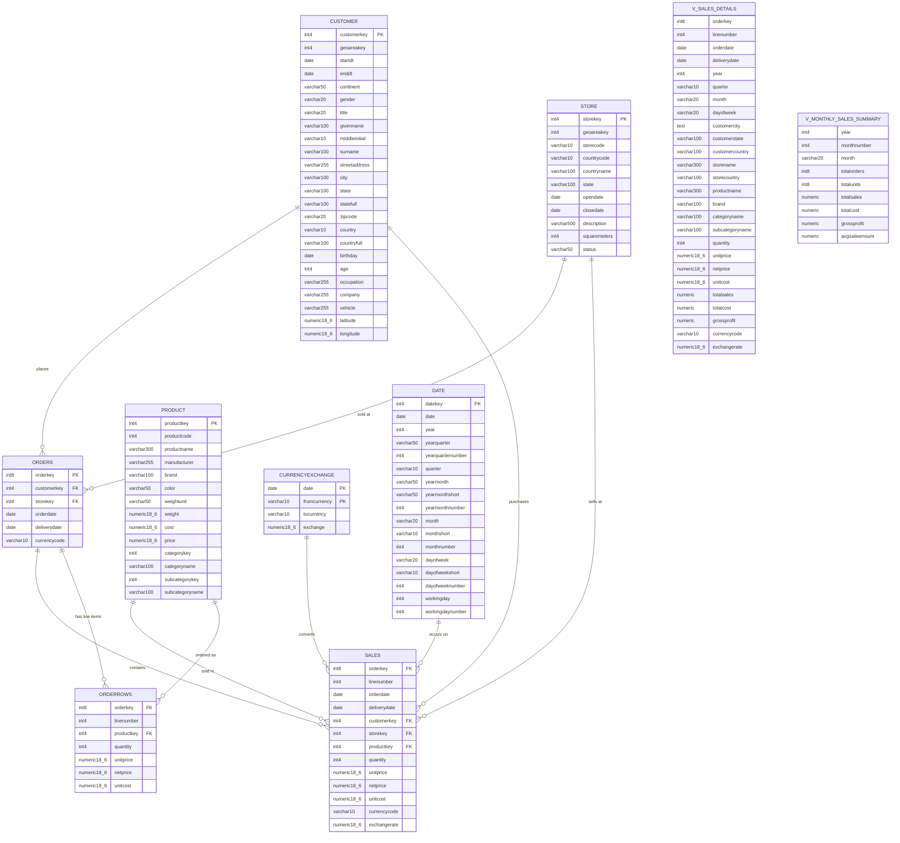

# Appendix: Database Schema

## 📊 Table Relationships

> [!info] Visual Relationship Diagram



---

## 📋 Table Details

### customer Table
Contains customer demographic and contact information.

**Key Columns:**
- `customerkey` (PK) - Unique customer identifier (int4)
- `geoareakey` - Geographic area identifier (int4)
- `startdt` - Customer start date (date)
- `enddt` - Customer end date (date)
- `continent` - Continent name (varchar50)
- `gender` - Gender M/F (varchar20)
- `title` - Title (Mr/Mrs/Ms/Dr) (varchar20)
- `givenname` - First name (varchar100)
- `middleinitial` - Middle initial (varchar10)
- `surname` - Last name (varchar100)
- `streetaddress` - Street address (varchar255)
- `city` - City name (varchar100)
- `state` - State abbreviation (varchar100)
- `statefull` - Full state name (varchar100)
- `zipcode` - ZIP/postal code (varchar20)
- `country` - Country code (varchar10)
- `countryfull` - Full country name (varchar100)
- `birthday` - Date of birth (date)
- `age` - Customer age (int4)
- `occupation` - Customer occupation (varchar255)
- `company` - Company name (varchar255)
- `vehicle` - Vehicle type (varchar255)
- `latitude` - Geographic latitude (numeric18,6)
- `longitude` - Geographic longitude (numeric18,6)

**Typical Row Count:** ~2,000,000+ customers

---

### product Table
Complete product catalog with pricing and categorization.

**Key Columns:**
- `productkey` (PK) - Unique product identifier (int4)
- `productcode` - Product code (int4)
- `productname` - Product name/description (varchar300)
- `manufacturer` - Manufacturer name (varchar255)
- `brand` - Brand name (varchar100)
- `color` - Product color (varchar50)
- `weightunit` - Weight unit of measurement (varchar50)
- `weight` - Product weight (numeric18,6)
- `cost` - Cost to company (numeric18,6)
- `price` - List/retail price (numeric18,6)
- `categorykey` - Category identifier (int4)
- `categoryname` - Product category (varchar100)
- `subcategorykey` - Subcategory identifier (int4)
- `subcategoryname` - Product subcategory (varchar100)

**Typical Row Count:** ~2,500 products

**Categories Include:**
- Audio
- Cameras and camcorders
- Cell phones
- Computers
- Games and Toys
- Home Appliances
- Music, Movies and Audio Books
- TV and Video

---

### store Table
Physical retail location information.

**Key Columns:**
- `storekey` (PK) - Unique store identifier (int4)
- `geoareakey` - Geographic area identifier (int4)
- `storecode` - Store code (varchar10)
- `countrycode` - Country code (varchar10)
- `countryname` - Country name (varchar100)
- `state` - State/province (varchar100)
- `opendate` - Store opening date (date)
- `closedate` - Store closing date if closed (date)
- `description` - Store description (varchar500)
- `squaremeters` - Store size in square meters (int4)
- `status` - Open/Closed status (varchar50)

**Typical Row Count:** ~200 stores

---

### date Table
Date dimension table with calendar and fiscal information.

**Key Columns:**
- `datekey` (PK) - Date identifier (int4)
- `date` - Actual date (date)
- `year` - Year (int4)
- `yearquarter` - Year and quarter combined (varchar50)
- `yearquarternumber` - Year quarter as number (int4)
- `quarter` - Quarter Q1-Q4 (varchar10)
- `yearmonth` - Year and month combined (varchar50)
- `yearmonthshort` - Year and month abbreviated (varchar50)
- `yearmonthnumber` - Year month as number (int4)
- `month` - Month name (varchar20)
- `monthshort` - Month abbreviation (varchar10)
- `monthnumber` - Month number 1-12 (int4)
- `dayofweek` - Day name (varchar20)
- `dayofweekshort` - Day abbreviation (varchar10)
- `dayofweeknumber` - Day number 1-7 (int4)
- `workingday` - Is working day flag (int4)
- `workingdaynumber` - Working day number (int4)

**Date Range:** Typically 2000-2030

---

### sales Table
⚠️ **THE BIG TABLE** - Individual transaction line items.

**Key Columns:**
- `orderkey` (FK) - Order identifier (int8)
- `linenumber` - Line number within order (int4)
- `orderdate` - Date order was placed (date)
- `deliverydate` - Date order was delivered (date)
- `customerkey` (FK) - Customer who made purchase (int4)
- `storekey` (FK) - Store where sold, NULL for online (int4)
- `productkey` (FK) - Product sold (int4)
- `quantity` - Number of units sold (int4)
- `unitprice` - Price per unit at time of sale (numeric18,6)
- `netprice` - Price after discounts (numeric18,6)
- `unitcost` - Cost per unit (numeric18,6)
- `currencycode` - Currency used USD, EUR, etc. (varchar10)
- `exchangerate` - Exchange rate to USD (numeric18,6)

**Typical Row Count:** 20,000,000+ rows (THIS IS BIG!)

**Key Calculations:**
- Revenue: `quantity * netprice`
- Cost: `quantity * unitcost`
- Profit: `(quantity * netprice) - (quantity * unitcost)`
- Margin: `profit / revenue`

> [!warning] Performance Warning
> Always test queries on this table with LIMIT first! Queries can take minutes to run.

---

### orders Table
Order header information (one row per order).

**Key Columns:**
- `orderkey` (PK) - Unique order identifier (int8)
- `customerkey` (FK) - Customer who placed order (int4)
- `storekey` (FK) - Store, NULL for online orders (int4)
- `orderdate` - Date order was placed (date)
- `deliverydate` - Date order was delivered (date)
- `currencycode` - Currency used (varchar10)

**Typical Row Count:** ~5,000,000 orders

**Relationship:** One order can have many sales and orderrows (line items)

---

### orderrows Table
Individual line items within orders.

**Key Columns:**
- `orderkey` (FK) - Order this row belongs to (int8)
- `linenumber` - Line number within order (int4)
- `productkey` (FK) - Product ordered (int4)
- `quantity` - Number of units ordered (int4)
- `unitprice` - Price per unit (numeric18,6)
- `netprice` - Price after discounts (numeric18,6)
- `unitcost` - Cost per unit (numeric18,6)

**Typical Row Count:** ~20,000,000 rows

**Relationship:** Many orderrows belong to one order

---

### currencyexchange Table
Daily exchange rates for currency conversion.

**Key Columns:**
- `date` (PK) - Date of exchange rate (date)
- `fromcurrency` (PK) - Source currency code (varchar10)
- `tocurrency` - Target currency code (varchar10)
- `exchange` - Exchange rate (numeric18,6)

**Typical Row Count:** ~50,000 rows (currencies × days)

**Usage:** 
To convert any amount to USD: `amount * exchange`

**Note:** The composite primary key is (date, fromcurrency)

---

## 🔗 Join Patterns

### Common Join Pattern 1: Sales Analysis
```sql
SELECT ...
FROM sales s
JOIN customer c ON s.customerkey = c.customerkey
JOIN product p ON s.productkey = p.productkey
JOIN store st ON s.storekey = st.storekey  -- Note: NULL for online orders
WHERE ...
```

### Common Join Pattern 2: Order Details
```sql
SELECT ...
FROM orders o
JOIN orderrows r ON o.orderkey = r.orderkey
JOIN product p ON r.productkey = p.productkey
JOIN customer c ON o.customerkey = c.customerkey
WHERE ...
```

### Common Join Pattern 3: Currency Conversion
```sql
SELECT 
    s.*,
    s.quantity * s.netprice * ce.exchange as revenue_usd
FROM sales s
JOIN currencyexchange ce 
    ON DATE(s.orderdate) = ce.date 
    AND s.currencycode = ce.fromcurrency
WHERE ...
```

### Common Join Pattern 4: Date Dimension
```sql
SELECT 
    d.year,
    d.quarter,
    d.month,
    SUM(s.quantity * s.netprice) as revenue
FROM sales s
JOIN date d ON DATE(s.orderdate) = d.date
GROUP BY d.year, d.quarter, d.month
ORDER BY d.year, d.monthnumber;
```

---

## 🎯 Important Notes

> [!warning] Key Facts to Remember
> - **customerkey**, **productkey**, **storekey**, **orderkey** are your main join keys
> - **sales** table is huge (20M+ rows) - always filter or use LIMIT during testing
> - **orderkey + linenumber** is the composite key for sales and orderrows
> - **sales** table does NOT have a datekey - use the orderdate column directly
> - **date** table join: `JOIN date d ON DATE(s.orderdate) = d.date`
> - **currencycode** must match to convert to USD via currencyexchange table
> - **storekey** is NULL for online orders - use LEFT JOIN if you need all sales

> [!tip] Performance Tips
> - Index columns: customerkey, productkey, storekey, orderkey, orderdate
> - Filter by date early in queries to reduce rows
> - Use EXPLAIN ANALYZE to check query performance
> - Test with LIMIT 100 before running full queries
> - Be careful with date joins - make sure to cast properly

---

← [[00-Index|Back to Home]]